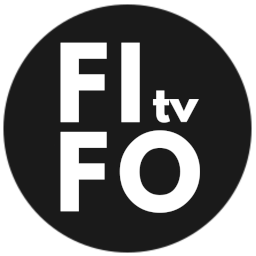
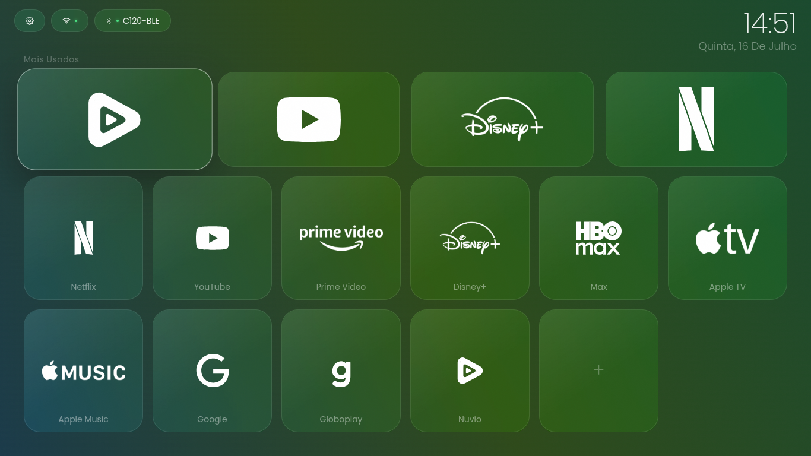
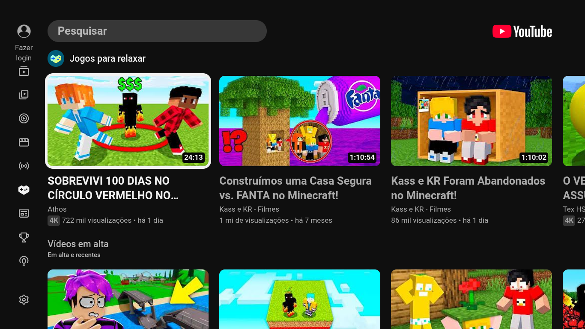
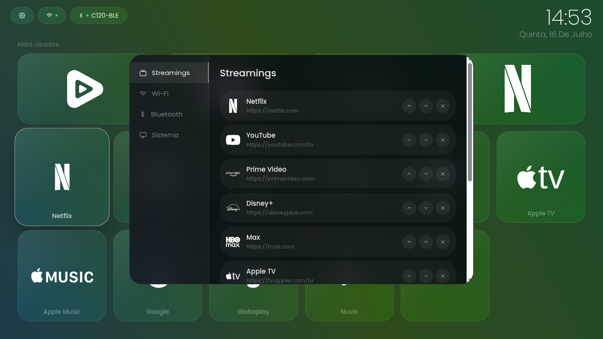
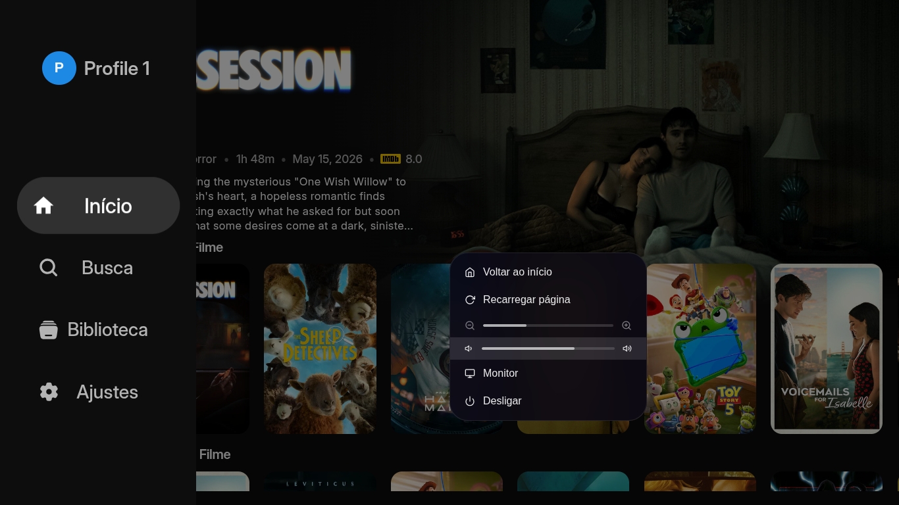

<p align="center">
  
</p>

<h1 align="center">FIFOtv</h1>

<p align="center">
  Uma interface de entretenimento para TV, simples, bonita e controlável por D-pad.
</p>

<p align="center">
  <a href="#status">Status</a> •
  <a href="#recursos">Recursos</a> •
  <a href="#testar-o-projeto">Testar</a> •
  <a href="#roadmap">Roadmap</a>
</p>

<p align="center">
  
  
  
</p>

<br>

<p align="center">
  
</p>

## O que é

O FIFOtv reúne serviços de entretenimento em uma experiência de TV unificada. A proposta é deixar o acesso aos seus conteúdos favoritos mais direto, visual e natural para quem está usando uma televisão e um controle remoto, em vez de um desktop tradicional.

Atualmente, o FIFOtv acessa versões web dos serviços de streaming e adiciona adaptações próprias para melhorar a navegação por D-pad, a reprodução em tela cheia e a integração com a experiência de TV.

## Recursos

- Interface pensada para telas de TV
- Navegação por D-pad, teclado ou controle remoto
- Acesso rápido aos serviços mais usados
- Reprodução em tela cheia
- Menu contextual sobre o conteúdo em reprodução
- Controle de volume e mute
- Integração com Wi-Fi e Bluetooth
- Gerenciamento, adição e ordenação de serviços
- Monitoramento básico de CPU, memória, disco e processos
- Personalizações específicas para diferentes serviços de streaming

## Por dentro da experiência

<table>
  <tr>
    <td width="50%" align="center">
      
      <br><sub>Serviços web apresentados em uma experiência de TV</sub>
    </td>
    <td width="50%" align="center">
      
      <br><sub>Catálogo de serviços configurável</sub>
    </td>
  </tr>
  <tr>
    <td width="50%" align="center">
      
      <br><sub>Controles acessíveis durante a reprodução</sub>
    </td>
    <td width="50%"></td>
  </tr>
</table>

## Status

O FIFOtv está em fase **beta** e ainda não possui uma release oficial. A interface e os recursos principais estão sendo desenvolvidos e validados gradualmente.

As imagens acima representam a experiência atual do projeto, mas alguns serviços podem se comportar de maneira diferente conforme suas próprias páginas web, atualizações e requisitos.

## Testar o projeto

Ainda não há um executável oficial para download. Se quiser experimentar o FIFOtv, você pode executá-lo a partir do código-fonte em uma distribuição Linux compatível:

```bash
git clone https://github.com/rafaelrib3iro/FIFOtv.git
cd FIFOtv
npm install
npm run dev
```

Para executar manualmente no Debian/all-in-one, use o comando explícito de appliance. Ele encaminha o argumento operacional `--kiosk` ao mesmo runtime:

```bash
npm run appliance
```

`npm start` permanece como alias de compatibilidade. O argumento não cria hoje um segundo modo de janela.

O resultado pode variar de acordo com a distribuição, o hardware, os drivers e as dependências disponíveis no sistema.

## Desenvolvimento

Os comandos principais são:

| Comando | Descrição |
| --- | --- |
| `npm run dev` | Inicia o Electron diretamente no Linux |
| `npm run dev:mac` | Inicia o Electron com o perfil de desenvolvimento macOS |
| `npm run visual` | Abre a interface em uma URL local para revisão visual |
| `npm run appliance` | Inicia manualmente o runtime Debian/all-in-one e encaminha `--kiosk` |
| `npm start` | Alias de compatibilidade de `npm run appliance` |

A documentação técnica, a arquitetura e os procedimentos de validação estão organizados em [`docs/README.md`](docs/README.md).

## Roadmap

- [ ] Publicar a primeira release oficial
- [ ] Criar uma distribuição oficial
- [ ] Melhorar a navegação por controle remoto e D-pad
- [ ] Expandir as adaptações específicas para cada serviço

Hoje, o FIFOtv trabalha com sites web e adaptações próprias para aproximar a navegação da experiência de uma Smart TV.

## Contribuindo

Sugestões, correções e melhorias são bem-vindas. Antes de abrir uma contribuição, consulte as [issues](https://github.com/rafaelrib3iro/FIFOtv/issues) existentes para evitar trabalho duplicado.

## Licença

O código original do FIFOtv é distribuído sob a licença **GNU General Public License v3.0**. Isso permite usar, estudar, modificar e redistribuir o projeto, mas versões modificadas distribuídas também devem permanecer abertas e disponibilizar seu código-fonte sob a mesma licença.

Consulte o arquivo [LICENSE](LICENSE) para o texto completo.

Marcas, logotipos, nomes e conteúdos dos serviços de streaming pertencem aos seus respectivos proprietários. A licença do FIFOtv cobre apenas o código original do projeto.
